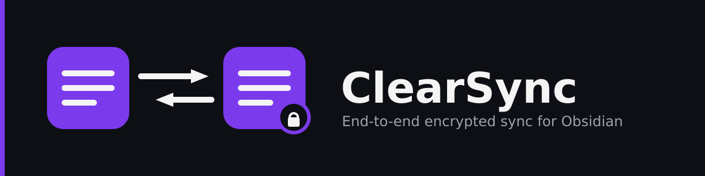

  

  
  
  

  🇪🇸 <a href="#español">Español</a> &nbsp;·&nbsp; 🇬🇧 <a href="#english">English</a>

---

## Español

**ClearSync** es un plugin open source para [Obsidian](https://obsidian.md) que sincroniza tu vault entre dispositivos, empezando por Dropbox.

### Por qué existe

Las alternativas actuales no resuelven bien lo mismo de siempre:

- **Detección de cambios poco confiable** — basada en `mtime`, que varía entre sistemas de archivos y provoca falsos conflictos o sync perdido.
- **Pérdida silenciosa de datos** — last-write-wins sin aviso: el archivo más nuevo gana y el otro simplemente desaparece.
- **Sin cifrado real** — el proveedor de nube ve el contenido de tus notas en texto plano.
- **Sin visibilidad** — fallos de sync que nadie nota hasta que faltan notas.
- **Cierre de código o abandono** — la opción de pago es cerrada; la gratuita lleva 2 años sin mantenimiento.

### Diferenciadores

- 🔒 **Cifrado end-to-end** (AES-256-GCM) — el proveedor de nube nunca ve texto plano.
- 🔍 **Detección de cambios por hash de contenido**, no por `mtime`.
- 🔀 **Merge automático de tres vías** para notas de texto — resuelve conflictos reales sin intervención cuando es seguro hacerlo.
- 👁️ **Estado de sync siempre visible** — nunca un fallo silencioso.
- 🌐 **Interfaz bilingüe** (es/en) desde el día uno.
- 🧩 **Arquitectura extensible** — Dropbox es el MVP, la interfaz `SyncProvider` deja la puerta abierta a WebDAV, S3, Google Drive.

### Estado del proyecto

🚧 **Fase de documentación.** Antes de escribir código, este proyecto documenta a fondo sus requisitos funcionales, no funcionales, historias de usuario y restricciones — revisalos en [`docs/es/requisitos/`](docs/es/requisitos/). Todavía no hay plugin instalable.

### Stack técnico

TypeScript (estricto) · Obsidian Plugin API · esbuild · pnpm · ESLint + Prettier · Vitest (cobertura mínima 85%) · Dropbox API v2 (OAuth2 + PKCE)

Detalle completo: [`docs/es/requisitos/restricciones.md`](docs/es/requisitos/restricciones.md).

### Documentación

| Documento | Ruta |
| --- | --- |
| Roadmap | [`ROADMAP.md`](ROADMAP.md) |
| Requisitos funcionales (RF) | [`docs/es/requisitos/RFs/`](docs/es/requisitos/RFs/) |
| Requisitos no funcionales (RNF) | [`docs/es/requisitos/RNFs/`](docs/es/requisitos/RNFs/) |
| Historias de usuario (HU) | [`docs/es/requisitos/HUs/`](docs/es/requisitos/HUs/) |
| Restricciones | [`docs/es/requisitos/restricciones.md`](docs/es/requisitos/restricciones.md) |
| Referencia técnica | [`docs/es/referencia-tecnica/`](docs/es/referencia-tecnica/) |
| Conceptos (OWASP, patrones) | [`docs/es/conceptos/`](docs/es/conceptos/) |
| Instrucciones para agentes | [`CLAUDE.md`](CLAUDE.md) |

### Contribuir

El proyecto sigue un flujo **documentación primero**: ningún RF se implementa sin su documento correspondiente revisado y aprobado. Antes de abrir un PR de código, revisá `CLAUDE.md` y la restricción RO-003.

### Licencia

[MIT](LICENSE).

---

## English

**ClearSync** is an open source plugin for [Obsidian](https://obsidian.md) that syncs your vault across devices, starting with Dropbox.

### Why it exists

Current alternatives keep failing at the same things:

- **Unreliable change detection** — based on `mtime`, which varies across filesystems and causes false conflicts or missed syncs.
- **Silent data loss** — last-write-wins with no warning: the newer file wins and the other one just disappears.
- **No real encryption** — the cloud provider sees your notes' content in plain text.
- **No visibility** — sync failures nobody notices until notes go missing.
- **Closed source or abandoned** — the paid option is closed source; the free one hasn't been maintained in 2 years.

### Differentiators

- 🔒 **End-to-end encryption** (AES-256-GCM) — the cloud provider never sees plain text.
- 🔍 **Content-hash change detection**, not `mtime`.
- 🔀 **Automatic three-way merge** for text notes — resolves real conflicts without intervention when it's safe to do so.
- 👁️ **Sync status always visible** — never a silent failure.
- 🌐 **Bilingual interface** (es/en) from day one.
- 🧩 **Extensible architecture** — Dropbox is the MVP, the `SyncProvider` interface leaves the door open for WebDAV, S3, Google Drive.

### Project status

🚧 **Documentation phase.** Before writing any code, this project documents its functional and non-functional requirements, user stories, and constraints in depth — see [`docs/en/requisitos/`](docs/en/requisitos/). There is no installable plugin yet.

### Tech stack

TypeScript (strict) · Obsidian Plugin API · esbuild · pnpm · ESLint + Prettier · Vitest (85% minimum coverage) · Dropbox API v2 (OAuth2 + PKCE)

Full detail: [`docs/en/requisitos/restricciones.md`](docs/en/requisitos/restricciones.md).

### Documentation

| Document | Path |
| --- | --- |
| Roadmap | [`ROADMAP.md`](ROADMAP.md) |
| Functional requirements (RF) | [`docs/en/requisitos/RFs/`](docs/en/requisitos/RFs/) |
| Non-functional requirements (RNF) | [`docs/en/requisitos/RNFs/`](docs/en/requisitos/RNFs/) |
| User stories (HU) | [`docs/en/requisitos/HUs/`](docs/en/requisitos/HUs/) |
| Constraints | [`docs/en/requisitos/restricciones.md`](docs/en/requisitos/restricciones.md) |
| Technical reference | [`docs/en/referencia-tecnica/`](docs/en/referencia-tecnica/) |
| Concepts (OWASP, patterns) | [`docs/en/conceptos/`](docs/en/conceptos/) |
| Agent instructions | [`CLAUDE.md`](CLAUDE.md) |

### Contributing

The project follows a **documentation-first** workflow: no RF gets implemented without its corresponding document reviewed and approved. Before opening a code PR, check `CLAUDE.md` and constraint RO-003.

### License

[MIT](LICENSE).
