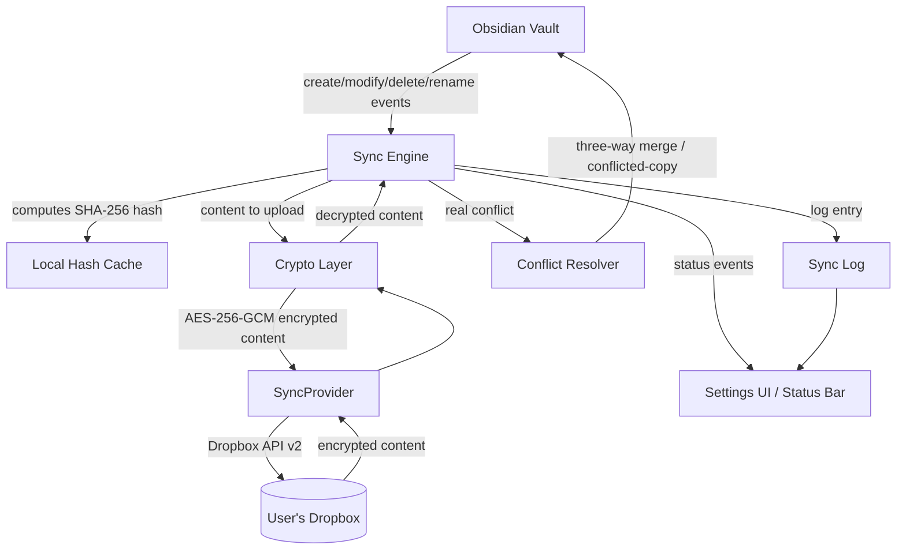

# Architecture — ClearSync

<!--
  What? Component view of the plugin and how the pieces relate to each other.
  Why? Any contributor should understand the whole system without reading all the code.
  Impact? Without this view, it's easy to couple Sync Engine directly to Dropbox and break RT-004/RNF-004.4.
-->

---

## Components

## Component descriptions

| Component             | Responsibility                                                                        | Related RF/RNF                 |
| --------------------- | ------------------------------------------------------------------------------------- | ------------------------------ |
| **Sync Engine**       | Orchestrates the sync cycle: change detection, scheduling, coordinates other modules  | RF-002, RNF-002                |
| **Local Hash Cache**  | Stores the last commonly-synced hash per file (base/local/remote)                     | RF-002                         |
| **Crypto Layer**      | Encrypts/decrypts content with AES-256-GCM, derives the key with PBKDF2/scrypt        | RF-005, RT-005                 |
| **SyncProvider**      | Interface abstracting the cloud provider; `DropboxProvider` is the MVP implementation | RT-004, RNF-004.4              |
| **Conflict Resolver** | Three-way merge for text (RF-003), conflicted-copy for binaries (RF-004)              | RF-003, RF-004                 |
| **Sync Log**          | Local history of operations (uploaded/downloaded/merged/conflict)                     | RF-007                         |
| **Settings UI**       | Configuration (account, encryption, exclusions, language) and visible status          | RF-006, RF-007, RF-008, RF-011 |

## Core design principle

`SyncProvider` is the only boundary with the cloud provider. No other component (Sync Engine, Crypto Layer, Conflict Resolver) knows anything about Dropbox's API details — this allows adding WebDAV/S3/Google Drive (future RF) without touching the rest of the system. See the Strategy pattern in [`docs/en/conceptos/patrones-arquitectonicos.md`](../conceptos/patrones-arquitectonicos.md).

## Sync cycle flow (summary)

1. Sync Engine detects changes via hashing (RF-002), applying exclusions (RF-008).
2. For files to upload: Crypto Layer encrypts → SyncProvider uploads.
3. For files to download: SyncProvider downloads → Crypto Layer decrypts.
4. If there's a real conflict: Conflict Resolver decides automatic merge or conflicted copy.
5. Every operation is logged in the Sync Log, which feeds the Settings UI and the status bar.
