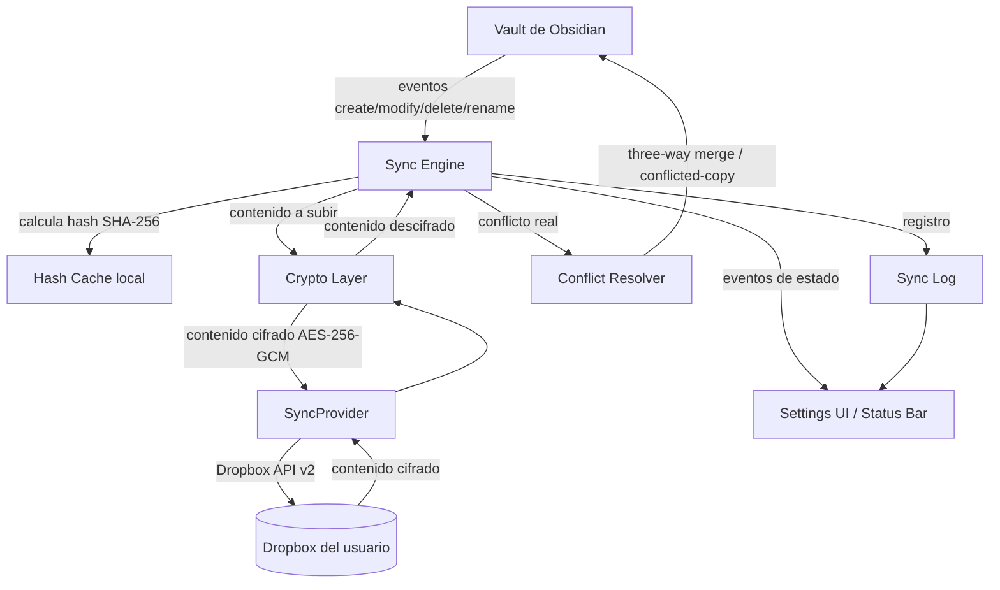

# Arquitectura — ClearSync

<!--
  ¿Qué? Vista de componentes del plugin y cómo se relacionan entre sí.
  ¿Para qué? Que cualquier colaborador entienda el sistema completo sin leer todo el código.
  ¿Impacto? Sin esta vista, es fácil acoplar Sync Engine a Dropbox directamente y romper RT-004/RNF-004.4.
-->

---

## Componentes

## Descripción de componentes

| Componente        | Responsabilidad                                                                 | RF/RNF relacionados |
| -------------------- | ----------------------------------------------------------------------------------- | ---------------------- |
| **Sync Engine**       | Orquesta el ciclo de sync: detección de cambios, scheduling, coordina el resto de módulos | RF-002, RNF-002       |
| **Hash Cache local**  | Guarda el último hash sincronizado en común por archivo (base/local/remoto)          | RF-002                 |
| **Crypto Layer**      | Cifra/descifra contenido con AES-256-GCM, deriva clave con PBKDF2/scrypt              | RF-005, RT-005         |
| **SyncProvider**      | Interfaz que abstrae el proveedor de nube; `DropboxProvider` es la implementación del MVP | RT-004, RNF-004.4      |
| **Conflict Resolver**  | Three-way merge para texto (RF-003), conflicted-copy para binarios (RF-004)           | RF-003, RF-004          |
| **Sync Log**           | Historial local de operaciones (subido/descargado/mergeado/conflicto)                 | RF-007                  |
| **Settings UI**        | Configuración (cuenta, cifrado, exclusiones, idioma) y estado visible                 | RF-006, RF-007, RF-008, RF-011 |

## Principio de diseño central

`SyncProvider` es la única frontera con el proveedor de nube. Ningún otro componente (Sync Engine, Crypto Layer, Conflict Resolver) conoce detalles de la API de Dropbox — eso permite agregar WebDAV/S3/Google Drive (RF futuro) sin tocar el resto del sistema. Ver patrón Strategy en [`docs/es/conceptos/patrones-arquitectonicos.md`](../conceptos/patrones-arquitectonicos.md).

## Flujo de un ciclo de sync (resumen)

1. Sync Engine detecta cambios vía hash (RF-002), aplicando exclusiones (RF-008).
2. Para archivos a subir: Crypto Layer cifra → SyncProvider sube.
3. Para archivos a bajar: SyncProvider descarga → Crypto Layer descifra.
4. Si hay conflicto real: Conflict Resolver decide merge automático o copia conflictiva.
5. Cada operación se registra en Sync Log, que alimenta la Settings UI y la barra de estado.
